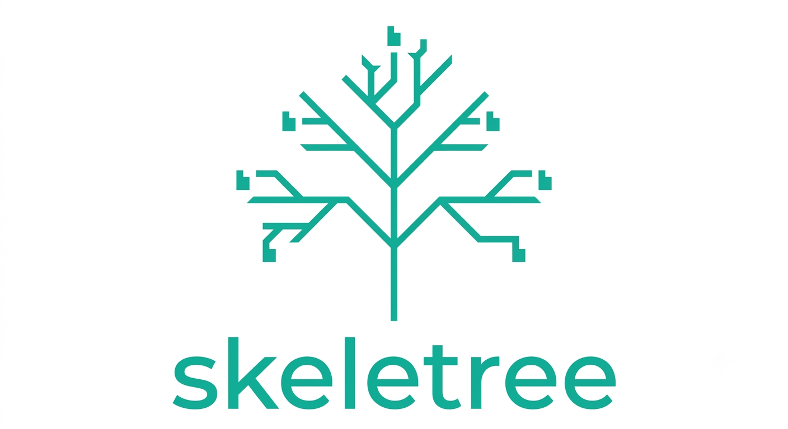
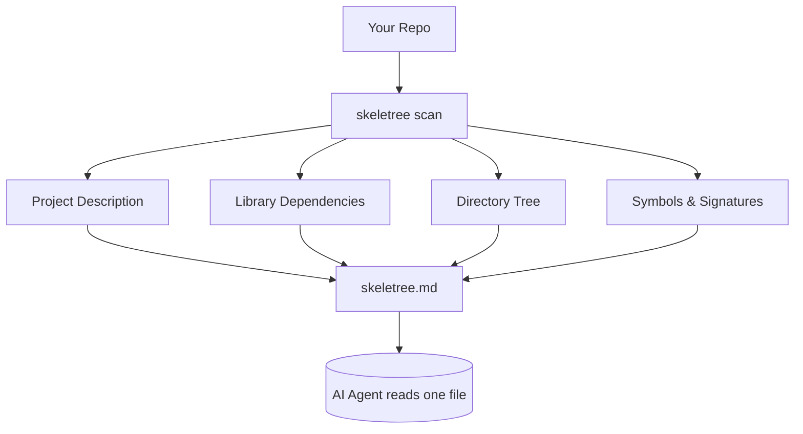

<p align="center">
  
</p>

[](https://github.com/daudibrahimhasan/skeletree/actions/workflows/ci.yml)
[](https://pypi.org/project/skeletree/)
[](https://pypi.org/project/skeletree/)
[](https://www.python.org/downloads/)
[](LICENSE)
[](https://github.com/daudibrahimhasan/skeletree)
[](https://github.com/daudibrahimhasan/skeletree/commits)
[](https://github.com/astral-sh/ruff)

# 🌳 skeletree

**Stop burning 50K tokens every time your AI agent opens a repo.**

```
$ uvx skeletree

Scan complete
  Files scanned : 106
  Total chars   : 3,176,672
  Estimated tokens to read this repo: 794.2K  (~794,168 tok)

Top contributors:
  .js            382.8K tok
  .html          329.3K tok
  .css            37.7K tok
  .svg            26.3K tok
  .md             10.4K tok
  .json            7.7K tok

skeleeeeed!
Token need now: 759 tok
  106 files (1 parsed, 105 cached)
→ skeletree.md
```

> No `uv` or `pipx`? `pip install skeletree` works too — see [Install](#install) below.

**🔒 100% local — your code never leaves your machine. No API calls, no telemetry.**

---

## Table of contents

- [How it works](#how-it-works)
- [Real repos, real savings](#real-repos-real-savings)
- [What's in the map](#whats-in-the-map)
- [Why skeletree?](#why-skeletree)
- [Install](#install)
- [Usage](#usage)
- [Wire it into Claude Code](#wire-it-into-claude-code-permanent-setup)
- [Languages](#languages)
- [Dependency detection](#dependency-detection)
- [How the token metric works](#how-the-token-metric-works)
- [Config](#config-optional)
- [Performance](#performance)
- [Contributing](#contributing)

---

When Claude Code, Cursor, or Aider opens an unfamiliar repo, the first thing it does is *read files* — a lot of them — just to figure out the shape of the codebase. That exploration routinely costs **30–80K tokens** before any real work starts.

`skeletree` does that exploration once, deterministically, for almost nothing:

```bash
uvx skeletree
```

One command scans your repo and writes `skeletree.md` — a compact map containing the **project description**, **library dependencies**, **directory tree**, and every **class, function, and signature**, with no function bodies. An agent reads that one file and knows the codebase cold.

---

## How it works

<div align="center">



</div>

---

## Real repos, real savings

Tested across five real projects spanning Python, Kotlin, TypeScript, and multi-language stacks:

| Project | Domain | Stack | Map size | Savings |
| :--- | :--- | :--- | ---: | ---: |
| **`oss-hunter`** | Dev tooling / automation | Python, GitHub API | ~890 tok | **−92%** |
| **`wc2026-ml`** | ML & analytics | LightGBM, Keras, Pandas | ~32.8K tok | **−99%** |
| **`sapphire-app`** | Mobile (Android) | Kotlin, Compose, Room | ~467 tok | **−99%** |
| **`thesisMap`** | Academic matching | React, Supabase, Python | ~1.0K tok | **−100%** |
| **`whattheproject`** | Marketplace SaaS | Next.js, Supabase, GenAI | ~694 tok | **−100%** |

<p align="center">
  
</p>

---

## What's in the map

````markdown
# myapp
> A production-grade HTTP API for managing user accounts.
> skeletree · map≈5.1K tok · ~90% smaller

## Deps
python: fastapi, sqlalchemy, pydantic, alembic | dev: pytest, ruff

## Tree
```
myapp/
  src/
    api.py
    models.py
    auth.py
  migrations/ (142 files)
```

## Symbols
src/api.py
- class Server — HTTP entry point.
  - async start(self, port: int) -> None
  - route(self, path: str, handler)
- create_app(config: Config) -> Server — Build the app from config.

src/models.py
- class User
  - __init__(self, email: str, role: str)
  - @property is_admin(self) -> bool
````

Every section is there for a reason:
- **Description** — what the project does, pulled from `pyproject.toml`, `package.json`, or the README
- **Deps** — runtime and dev libraries so the agent knows what's available without reading any manifest
- **Tree** — directory structure; noisy dirs (migrations, fixtures, assets) collapse to a count
- **Symbols** — every class, function, and method with its full signature and first docstring line — no bodies

---

## Why skeletree?

You might already know about other tools. Here's how they compare:

| | **skeletree** | **repomix** | **ctags** | **Aider repo-map** |
| :--- | :--- | :--- | :--- | :--- |
| **Output** | Single `.md` with description, deps, tree, and signatures | One giant concatenated file of all source code | Tags file (symbol → location index) | Internal tree-sitter map (not exportable) |
| **Token cost** | ~90–100% smaller than raw source | Larger than raw source (adds boilerplate per file) | N/A (not designed for LLM consumption) | Hidden; re-computed every prompt |
| **Deps & description** | ✅ Extracted from manifests | ❌ | ❌ | ❌ |
| **Incremental cache** | ✅ mtime + size keyed | ❌ Full re-concat | ✅ | ✅ |
| **Works with any agent** | ✅ Plain `.md` / `.json` file | ✅ Plain text | Needs editor plugin | Aider only |
| **Privacy** | 100% local, zero network calls | 100% local | 100% local | 100% local |

**TL;DR:** `repomix` gives your agent *all* the code (expensive). `ctags` gives a symbol index editors understand but LLMs don't. Aider's repo-map is good but locked inside Aider. `skeletree` gives any agent a *minimal, structured overview* — just enough to navigate, cheap enough to include in every prompt.

---

## Install

No install needed for a one-off run:

```bash
uvx skeletree       # uv
pipx run skeletree  # pipx
```

Install globally to use in any project:

```bash
pipx install skeletree
```

Or into a project venv:

```bash
pip install skeletree
```

---

## Usage

```bash
skeletree                   # scan current dir → skeletree.md
skeletree path/to/repo      # scan a different repo by path
skeletree -o -              # print the map to stdout instead of writing a file
skeletree --format json     # emit machine-readable JSON (useful for piping into
                            #   other tools or building custom dashboards)
skeletree --max-files 2000  # cap the number of files parsed — helpful for massive
                            #   monorepos where you only need a partial overview
skeletree --no-cache        # force a full re-parse, ignoring the incremental cache
```

---

## Wire it into Claude Code (permanent setup)

Run once inside your project:

```bash
skeletree init
```

This creates a `CLAUDE.md` file telling Claude to read the map before doing anything, and prints an opt-in `SessionStart` hook snippet you can paste into your Claude Code `settings.json` to auto-regenerate the map on every session start.

Or set it up manually — create these two files in your project:

**`CLAUDE.md`**
```markdown
Project map: see `skeletree.md` — regenerate with `skeletree`.
Read it before doing anything.
```

**`.claude/settings.json`**
```json
{
  "hooks": {
    "SessionStart": [
      {
        "hooks": [
          { "type": "command", "command": "skeletree --quiet" }
        ]
      }
    ]
  }
}
```

Now every Claude Code session automatically regenerates the map and reads it before touching any code. Works with Cursor and Aider too — just point them at the `.md` file.

---

## Languages

Python is extracted with the stdlib `ast` module (zero extra dependencies, richest output). Everything else goes through [tree-sitter](https://tree-sitter.github.io/) with prebuilt wheels — **no compiler required**:

**Python · JavaScript · TypeScript · TSX · Go · Rust · Java · Ruby · C · C++**

Unknown file types still appear in the tree, just without a symbol breakdown.

---

## Dependency detection

skeletree reads the most common manifests and lists library names only — no version pins, to stay token-cheap:

| File | Ecosystem |
|------|-----------|
| `pyproject.toml` (PEP 621 + Poetry) | Python |
| `requirements.txt` / `requirements-dev.txt` | Python |
| `package.json` | Node |
| `Cargo.toml` | Rust |
| `go.mod` | Go |

---

## How the token metric works

skeletree estimates tokens using the `chars / 4` heuristic. It's deliberately not a real tokenizer: the value is the **ratio** (map vs. reading every file in full), and `chars/4` tracks Claude's tokenizer closely enough for that ratio while adding zero dependencies. The number is approximate, and skeletree says so.

---

## Config (optional)

Zero-config by default. To customize, add a `[tool.skeletree]` table to `pyproject.toml` or a standalone `.skeletree.toml`:

```toml
[tool.skeletree]
out = "custom-name.md"   # override the default skeletree.md
format = "md"            # md | json
max_files = 5000
collapse_threshold = 40  # collapse dirs with more than N direct files
ignore_dirs = ["fixtures", "snapshots"]
ignore = ["**/*.generated.*"]
```

skeletree always honors your `.gitignore` and skips the usual noise (`.git`, `node_modules`, `venv`, `dist`, `target`, …) automatically.

---

## Performance

An incremental cache (`.skeletree-cache.json`, keyed by path + mtime + size) means re-runs only re-parse changed files — so the `SessionStart` hook is effectively free on an unchanged repo.

---

## Contributing

Issues and PRs welcome — see [CONTRIBUTING.md](CONTRIBUTING.md). Adding a language is usually just a spec entry in `extractors/treesitter.py` plus a fixture test.

## License

MIT © skeletree contributors
